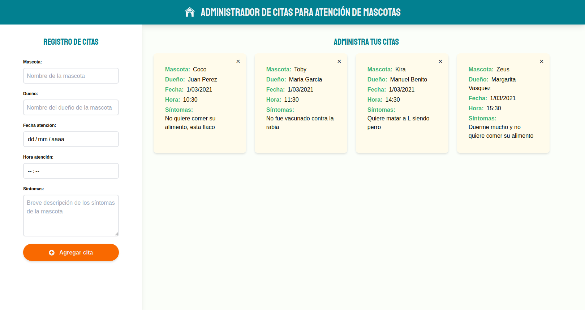

<h1 align="center">Administrador de citas para atención de mascotas</h1>

<div align="center">
  <h3>
    <a href="https://admin-pacientes-mascotas-react.netlify.app/">
      Demo
    </a>
    <span> | </span>
    <a href="https://github.com/carlossantesp/admin-pacientes-mascotas">
      Solución
    </a>
    <span>
  </h3>
</div>

## Tabla de contenido

- [Información](#información)
- [Desarrollado con](#desarrollado-con)
- [Instalación](#instalación)
- [Contacto](#contacto)

## Información



Mini aplicación de registro de citas para la atención de mascotas desarrollado en Reactjs.

## Desarrollado con

- [React](https://es.reactjs.org/docs/getting-started.html)
- [TailwindCSS](https://tailwindcss.com/docs)
- [Momentjs](https://momentjs.com/)

## Instalación

- Descargar el repositorio
  ```bash
  $ git clone https://github.com/carlossantesp/admin-pacientes-mascotas.git
  ```
- Instalar las dependecias

  **NPM**
  ```bash
  $ npm install
  ```

  **YARN**
  ```bash
  $ yarn install
  ```
- Ejecutar servidor de desarrollo

  **NPM**
  ```bash
  $ npm run start
  ```

  **YARN**
  ```bash
  $ yarn start
  ```
- Construir sitio web para el deploy

  **NPM**
  ```bash
  $ npm run build
  ```

  **YARN**
  ```bash
  $ yarn build
  ```

## Contacto

- Portafolio web [carlos.santillan.dev](https://carlos.santillan.dev)
- GitHub [@carlossantesp](https://github.com/carlossantesp)
- Linkedin [@dev-santillan-carlos](https://www.linkedin.com/in/dev-santillan-carlos)
